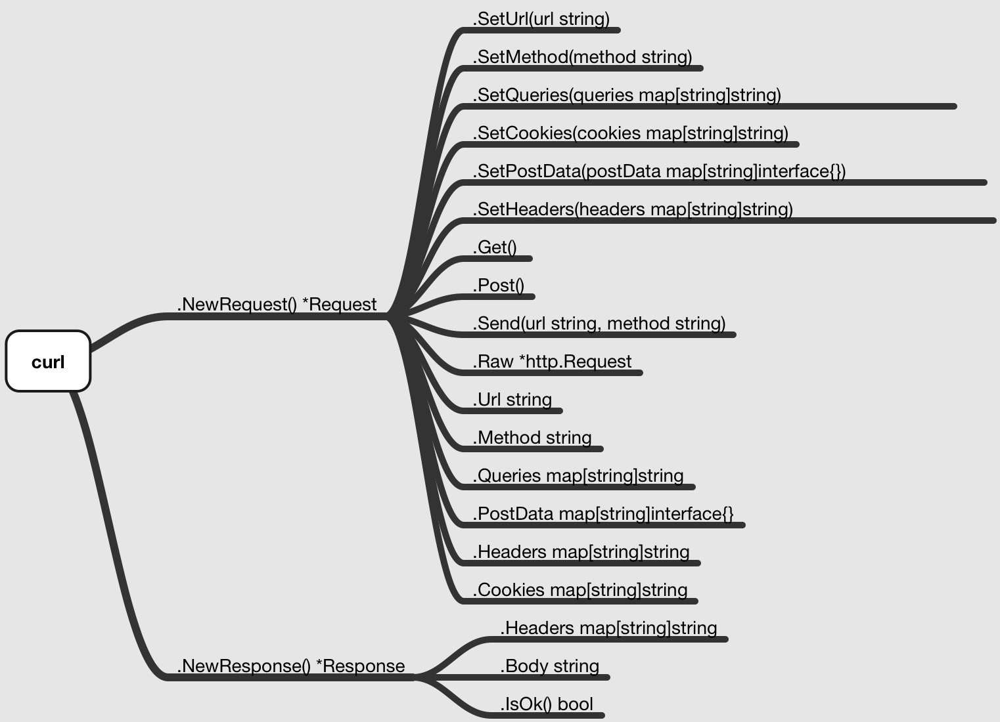

# golang版本的curl请求库


## 安装

```
go get github.com/mikemintang/go-curl
```
  
## 使用

```
package main

import (
    "fmt"
    "github.com/mikemintang/go-curl"
)

func main() {

    url := "http://php.dev/api.php?id=55"
    headers := map[string]string{
        "Content-Type": "application/x-www-form-urlencoded",
        "User-Agent":   "Sublime",
        "Version":      "0.1.0",
    }
    queries := map[string]string{
        "page": "2",
        "act":  "view",
        "user": "mike",
    }
    cookies := map[string]string{
        "uid":       "45",
        "loginTime": "1455623312",
    }
    postData := map[string]string{
        "title":   "this is a title",
        "content": "this is content",
    }

    // 发起post请求
    curl.Cli.
        SetUrl(url).           // 请求的url
        SetMethod("POST").     // 设置发送请求的方式
        SetQueries(queries).   // 请求查询参数
        SetPostData(postData). // post数据
        SetHeaders(headers).   // 设置请求头
        SetCookies(cookies).   // 设置cookie
        Send()

    fmt.Printf("%+v", curl.Res)
    fmt.Printf("%+v", curl.Req)
}

```


## 接收请求的api.php
```
<?php  

echo $_SERVER['REQUEST_METHOD'];
echo json_encode($_GET);
echo json_encode($_POST);
echo json_encode($_REQUEST);
echo json_encode(getallheaders());
echo json_encode($_COOKIE);
echo 'this is api.php';

function getallheaders() { 
    $headers = []; 
    foreach ($_SERVER as $name => $value) { 
       if (substr($name, 0, 5) == 'HTTP_') { 
           $headers[str_replace(' ', '-', ucwords(strtolower(str_replace('_', ' ', substr($name, 5)))))] = $value; 
       } 
    } 
    return $headers; 
} 
```

## 可导出的成员变量和方法


## TodoList

- [x] 以链式操作的方式发起请求
- [ ] 以函数回调的方式发起请求
- [ ] 以类Jquery Ajax的方式发起请求
- [x] 发起GET/POST请求
- [ ] 发起PUT/PATCH/DELETE/OPTIONS操作
- [x] 以application/x-www-form-urlencoded形式提交post数据
- [ ] 以application/json形式提交post数据
- [ ] 以multipart/form-data形式提交post数据
- [ ] proxy代理设置
